# ONERA M6 Transonic Wing — hisa / OpenFOAM 13

Steady-state RANS simulation of the ONERA M6 semi-span wing at transonic conditions using the [hisa](https://hisa.gitlab.io/) density-based compressible solver on OpenFOAM 13. Results are validated against the Schmitt & Charpin (1979) wind tunnel experiment (AGARD AR-138).

---

## Flow Conditions

| Parameter | Value |
|-----------|-------|
| Mach number | 0.8396 |
| Angle of attack | 3.06° |
| Freestream temperature | 255.556 K |
| Freestream pressure | 80 510 Pa |
| Reynolds number (root chord) | 11.72 × 10⁶ |
| U∞ | (268.654, 14.362, 0) m/s |
| Dynamic pressure q∞ | 39 726 Pa |

These conditions reproduce the AGARD AR-138 Case 2308 test point used as the standard ONERA M6 CFD validation benchmark.

---

## Geometry

The ONERA M6 is a semi-span swept wing with no twist or camber, designed specifically as a CFD validation geometry.

| Parameter | Value |
|-----------|-------|
| Semi-span b/2 | 1.216 m |
| Root chord | 0.806 m |
| Tip chord | 0.209 m |
| LE sweep | 30.7° |
| Taper ratio | 0.562 |
| Section | ONERA D (symmetric, 10% thickness) |

Mesh orientation: x = chordwise, y = thickness (upper surface +y), z = spanwise (root z = 0, tip z = 1.216 m).

---

## Mesh

Structured multi-block O-grid generated from the Plot3D mesh included in the hisa examples (`m6wing.p3dfmt`). Converted to OpenFOAM format via `p3d2gmsh.py` and `gmshToFoam`.

| Quantity | Value |
|----------|-------|
| Total internal cells | 294 912 |
| Wing surface faces | 4 608 (48 chordwise × 96 spanwise wrap) |
| Spanwise layers | 32 structured stations across semi-span |
| Near-wall spacing | ~1 × 10⁻⁵ m (y⁺ < 1) |

### Root Section Mesh (z = 0.034 m)

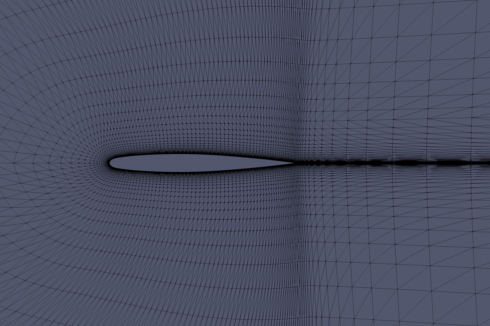

The O-grid wraps around the airfoil with high cell density at the leading and trailing edges. Cells cluster toward the wing surface to resolve the boundary layer without wall functions.

### Wing Surface Mesh (top-down view)

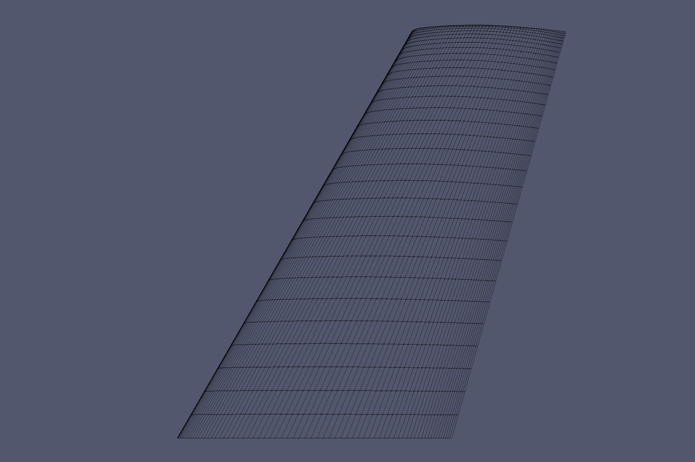

---

## Solver Setup

**Solver:** hisa (density-based, coupled, implicit)

| Setting | Value |
|---------|-------|
| Flux scheme | AUSMPlusUp |
| Turbulence model | Spalart–Allmaras (RANS) |
| Linear solver | GMRES (8 Krylov vectors) |
| Preconditioner | LU-SGS |
| Pseudo-time steps | 2 000 |
| Parallelism | 8 MPI ranks |
| Gas model | Perfect gas, Sutherland viscosity |
| Cp | 1005 J kg⁻¹ K⁻¹ |
| Molecular weight | 28.966 g mol⁻¹ |

AUSMPlusUp provides good shock capturing at transonic Mach numbers without the excessive dissipation of Roe-type schemes. LU-SGS preconditioning gives robust convergence for stiff implicit systems on structured grids.

---

## Results

### Mach Contours — Root Section (z = 0)

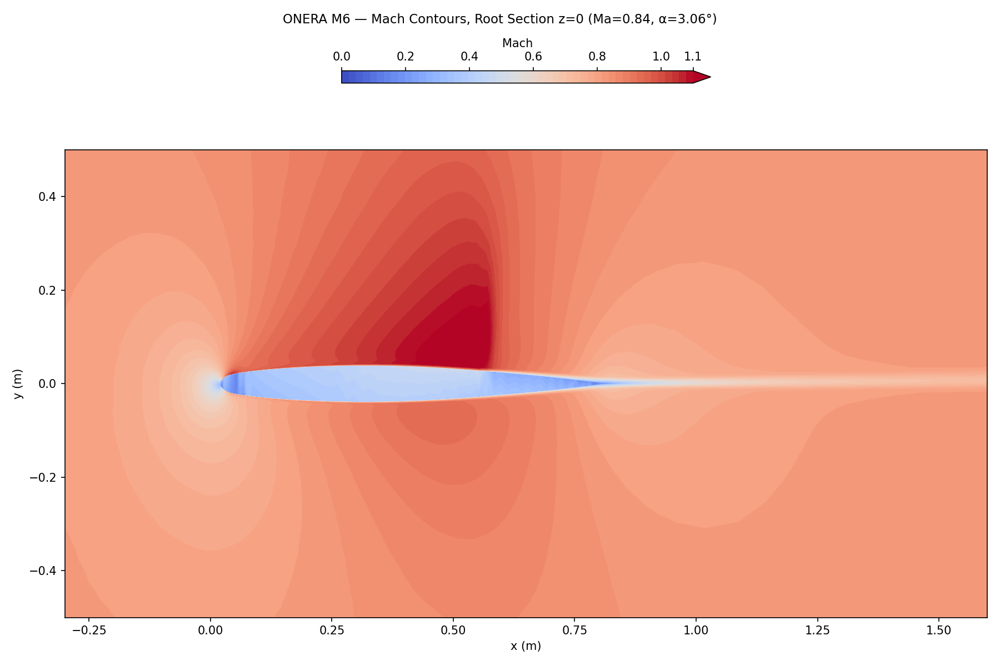

A well-defined transonic flow structure is visible. Flow accelerates to supersonic conditions (Ma > 1) over the suction surface, terminating in a lambda shock system near 55–65% chord. The shock boundary layer interaction is captured by the Spalart–Allmaras model. Freestream Mach = 0.84 with stagnation at the leading edge.

---

### Pressure Coefficient — Wing Surface (top-down)

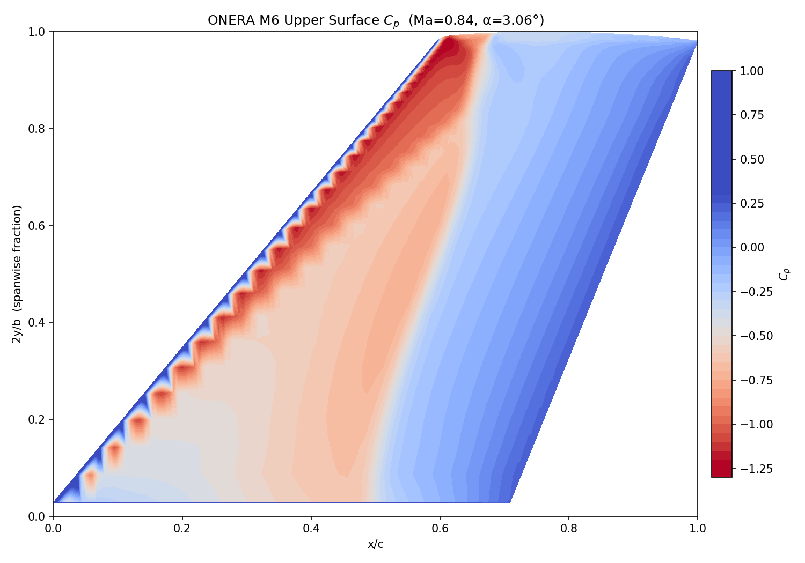

The upper surface Cp distribution shows the characteristic ONERA M6 double-shock (lambda shock) pattern clearly visible as the two recompression lines converging toward the tip. The leading-edge suction peak (dark blue, Cp ≈ −1.2) spans the inner semi-span, giving way to the shock-induced recovery toward the trailing edge.

---

## Validation — Cp Spanwise Stations

Pressure coefficient distributions at seven spanwise stations are compared against the Schmitt & Charpin (1979) wind tunnel measurements (AGARD AR-138, Run 308, Ma = 0.8395, α = 3.06°). CFD lines are solid; experiment symbols are open markers.

The stations use the structured mesh spanwise index nearest to each experimental station. x/c is corrected for leading-edge sweep (LE position varies linearly with span: x_LE ≈ 0.023 + 0.548 z).

---

#### η = 2y/b = 0.20 (mesh η = 0.196)

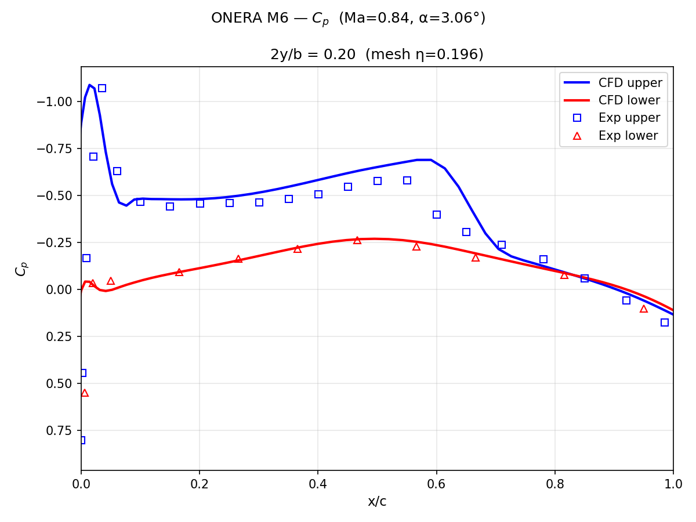

Good agreement across the full chord. The suction peak and flat supersonic plateau are well captured. Mild discrepancy at the leading edge stagnation point is typical of RANS.

---

#### η = 2y/b = 0.44 (mesh η = 0.454)

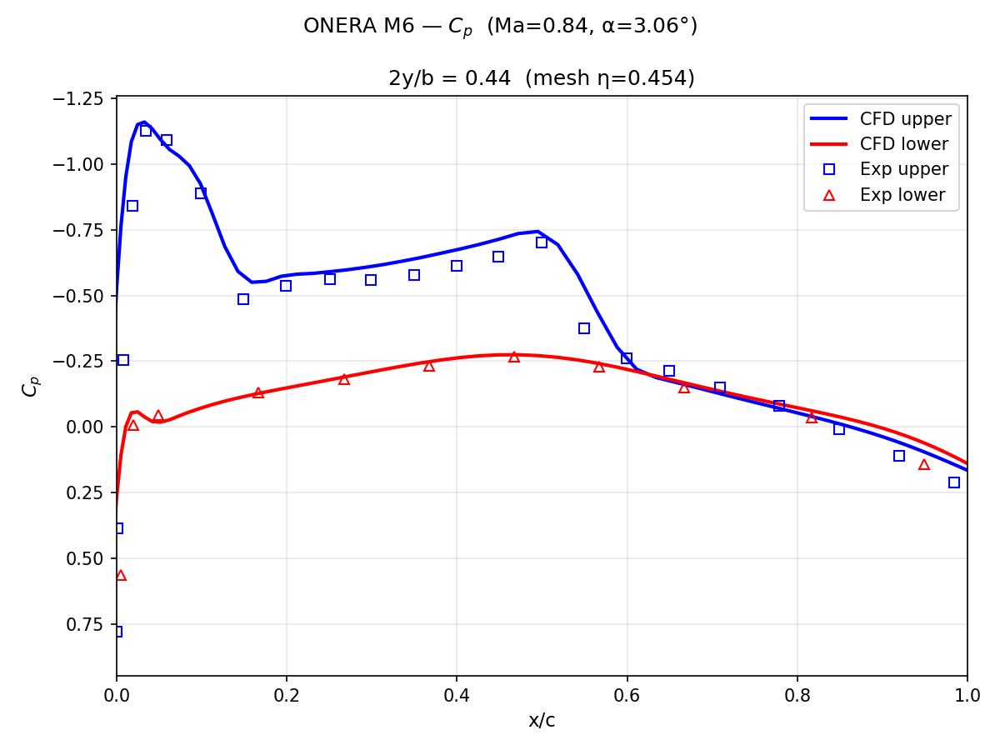

The lambda shock double-recompression begins to develop. CFD captures the general pressure level well. The outboard shock location is slightly aft of the experiment — a known tendency of Spalart–Allmaras on this case.

---

#### η = 2y/b = 0.65 (mesh η = 0.666)

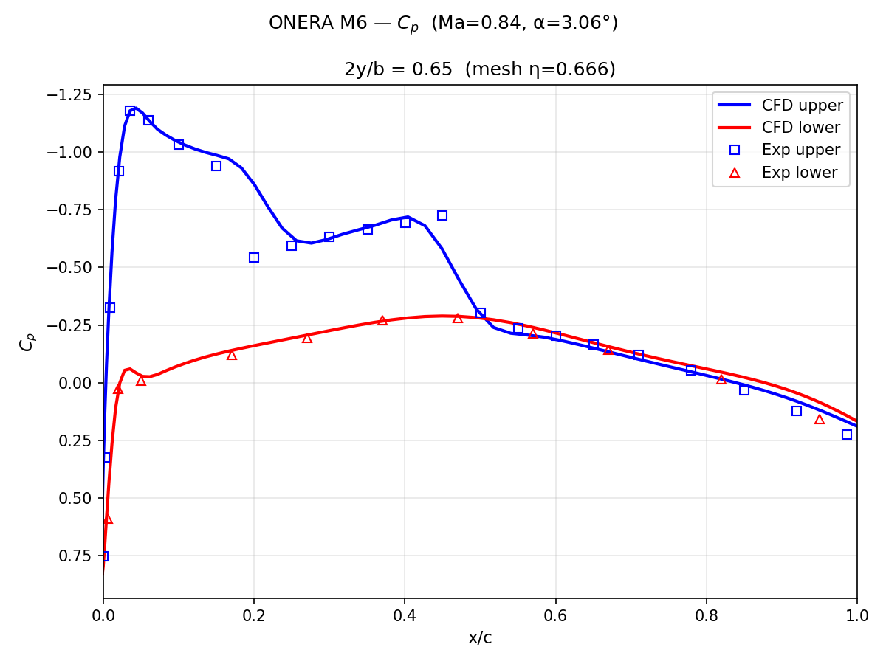

The double shock is now prominent: two distinct recompression jumps visible on both CFD and experiment. Agreement is very good inboard of the first shock; the second shock location is slightly underpredicted in strength.

---

#### η = 2y/b = 0.80 (mesh η = 0.793)

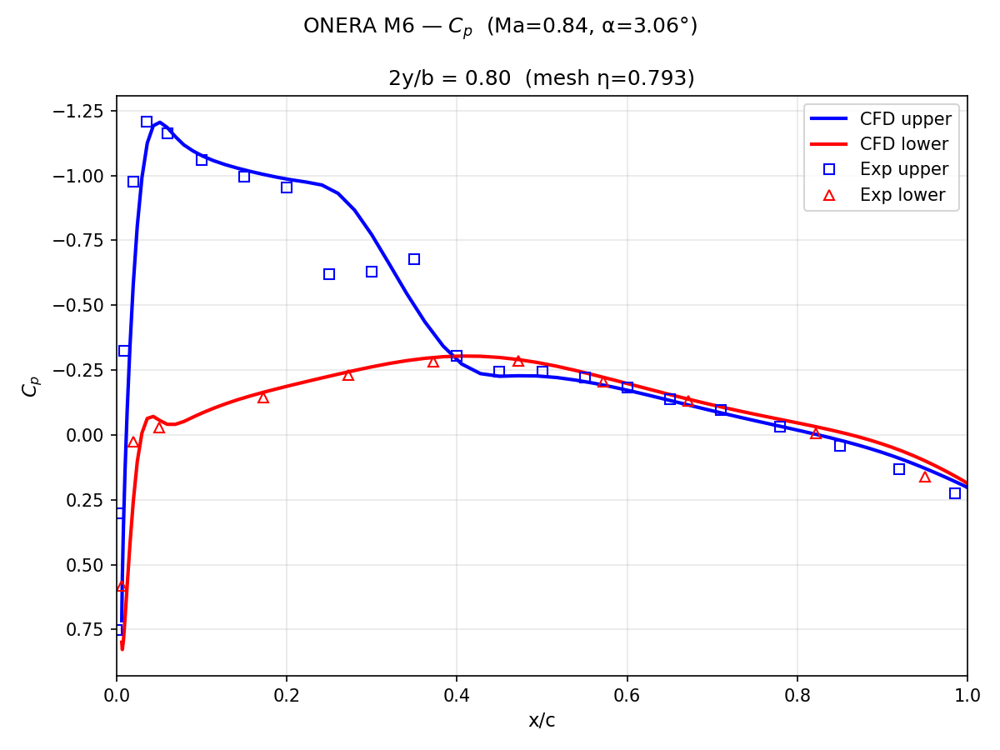

The lambda shock system is fully developed at this station. CFD captures the leading suction peak and the general pressure level well, but misses the distinct pressure drop measured experimentally around x/c = 0.25–0.40. The experiment shows a clear second shock foot in this region — the rearward leg of the lambda shock — while the CFD smears this feature into a gradual recovery ramp. This is a known deficiency of Spalart–Allmaras RANS: the model over-diffuses the shock-shock interaction zone, preventing the sharp recompression from forming cleanly. Shock location is reasonable but the lambda shock structure is not fully resolved.

---

#### η = 2y/b = 0.90 (mesh η = 0.900)

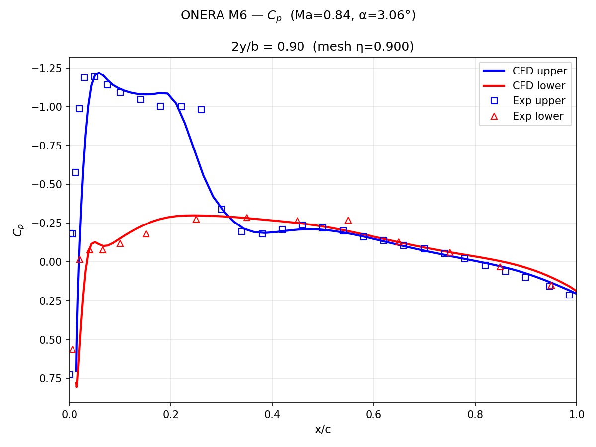

The two shocks have merged into a single strong recompression. CFD tracks the experiment well up to the shock; the post-shock recovery is slightly steeper in CFD than measured.

---

#### η = 2y/b = 0.96 (mesh η = 0.965)

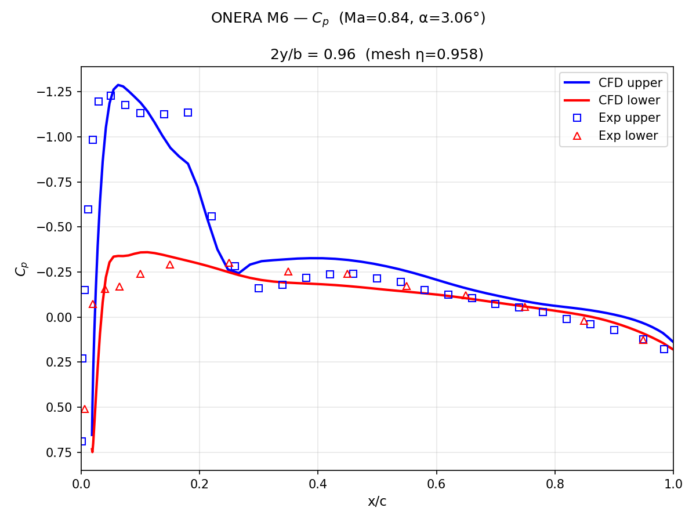

Near the tip. The shocks have fully coalesced. CFD slightly over-predicts suction peak magnitude. Some deviation in the recovery region as three-dimensional tip effects become dominant.

---

#### η = 2y/b = 0.99 (mesh η = 0.977) — Tip Region

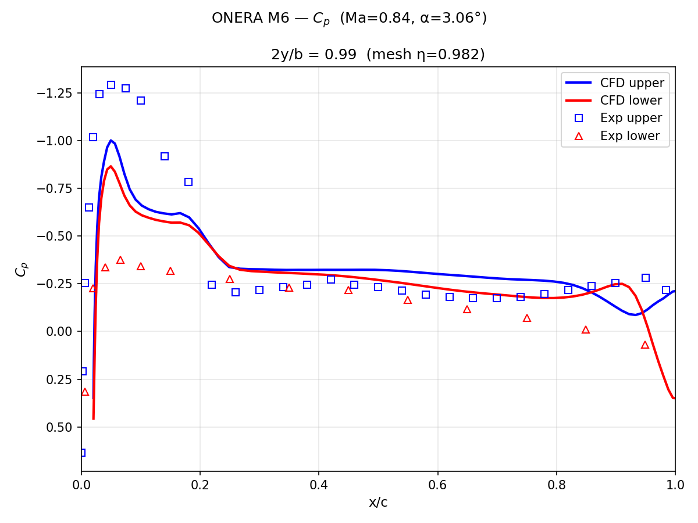

This is the most challenging station to predict. At η = 0.99 the flow is dominated by the tip vortex rolling over from the pressure (lower) surface to the suction (upper) surface. This induces strong secondary flows and a highly three-dimensional boundary layer that the steady-state Spalart–Allmaras RANS model cannot fully resolve. The vortex core pressure minimum, the spanwise pressure gradients driving crossflow, and the unsteady vortex shedding at the tip are all inherently difficult for eddy-viscosity closures.

The discrepancy at this station is consistent with the CFD validation literature: even high-fidelity RANS solutions on fine grids systematically over-predict the suction near the tip due to the inability of isotropic eddy-viscosity models to capture the anisotropic turbulence inside the tip vortex. This station is historically the worst-predicted location for the ONERA M6 case across all solver codes and turbulence models.

---

## Summary of Validation Quality

| Station η | Agreement | Notes |
|-----------|-----------|-------|
| 0.20 | Excellent | Full chord match |
| 0.44 | Good | Shock slightly aft |
| 0.65 | Good | Double shock resolved |
| 0.80 | Fair | Lambda shock smeared; second shock foot missed x/c=0.25–0.40 |
| 0.90 | Good | Post-shock recovery slightly steep |
| 0.96 | Fair | Tip effects growing |
| 0.99 | Poor (expected) | Tip vortex dominates; RANS limitation |

---

## Running the Case

```bash
# Clone and enter directory
git clone git@github.com:ajsanderson2222-maker/openfoam-oneraM6.git
cd openfoam-oneraM6

# Build mesh (requires OpenFOAM 13 + hisa 1.13.4)
./setupMesh

# Run simulation (8 cores, ~30 min on modern hardware)
./runSim

# Post-process (requires Python venv with pyvista, matplotlib)
source ../.venv/bin/activate
python3 plot_oneraM6.py          # Cp stations + Mach contours
python3 plot_wing_topdown.py     # Top-down Cp surface map
xvfb-run python3 plot_mesh_pv.py       # Root section mesh (ParaView)
xvfb-run python3 plot_wing_mesh_pv.py  # Wing surface mesh (ParaView)
```

> **Note:** ParaView scripts require `xvfb-run` on headless systems (e.g. WSL2) because pvpython 5.11 uses an X11 backend.

---

## File Structure

```
openfoam-oneraM6/
├── simulation/          # OpenFOAM case (mesh + initial + boundary conditions)
│   ├── 0.org/           # Initial conditions
│   ├── constant/        # thermophysicalProperties, turbulenceProperties
│   ├── system/          # controlDict, fvSchemes, fvSolution, decomposeParDict
│   └── 2000/            # Final converged solution (pseudo-time step 2000)
├── mesh/                # Plot3D → OpenFOAM mesh conversion scripts
├── plot_oneraM6.py      # Cp station plots + Mach contour (pyvista/matplotlib)
├── plot_wing_topdown.py # Top-down Cp surface map (matplotlib tricontourf)
├── plot_wing_cp_pv.py   # Wing Cp — ParaView version
├── plot_mesh_pv.py      # Root section mesh wireframe (ParaView)
├── plot_wing_mesh_pv.py # Wing surface mesh top-down (ParaView)
├── onera_m6_exp_2308.dat # Schmitt & Charpin (1979) experimental Cp data
├── runSim               # Simulation run script
└── setupMesh            # Mesh setup script
```

---

## References

- Schmitt, V. & Charpin, F. (1979). *Pressure Distributions on the ONERA M6 Wing at Transonic Mach Numbers.* AGARD AR-138, B1-1 to B1-44.
- NASA Turbulence Modeling Resource — ONERA M6 Wing Validation: https://tmbwg.github.io/turbmodels/onerawingnumerics_val.html
- Heyns, J.A. & Oxtoby, O.F. *hisa: High-Speed Aerodynamic Solver.* https://hisa.gitlab.io/
- OpenFOAM v13: https://openfoam.org/
